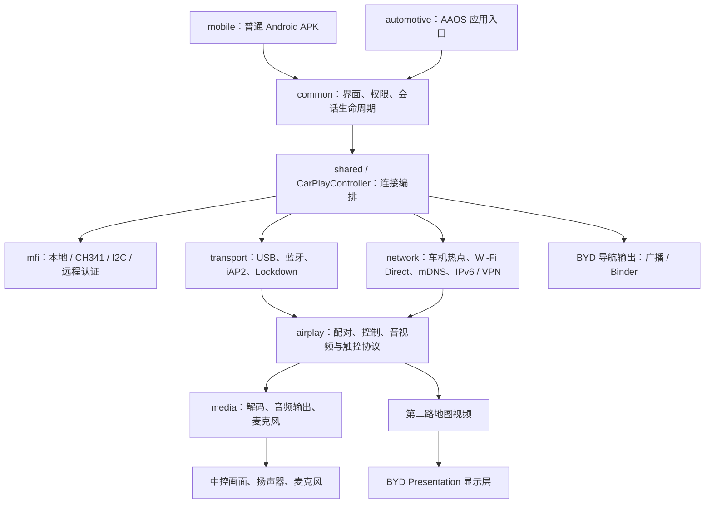

# DiPlay 架构、安全与 2024 款零跑 C11 适配评估

评估日期：2026-09-29。源码基线：`e6135d36e6a64ad85a94795b2dcbd54e826fa4c0`。

目标车辆：用户确认的 **2024 款 C11，纯电 580 km 尊享款，车机版本 3.11.40，允许安装第三方 APK**。目标手机为 **iPhone 13 / iOS 27.0**，常用高德地图；高德具体版本、Android API 级别、完整固件指纹及 ADB 可用性待采集。3.11.40 是车机软件版本，不能直接换算为 Android 版本。

当前目标已收敛为 **无线 CarPlay、中控显示、方向盘控制、仪表地图**。具体实现任务、接口验证分支和验收标准见 [无线 CarPlay 实现计划](/Users/miyuefe/MyGitHub/ai-space/DiPlay/docs/LEAPMOTOR_C11_WIRELESS_PLAN.zh-CN.md)。该计划替代本文初版“先测 USB、仪表后续可选”的顺序；仪表现为核心交付项。

本文是源码静态审查及公开资料评估；没有连接车辆、安装 APK、抓取车载通信或改动车机配置，也没有完成漏洞利用验证。下文“可行性”表示有无可复用的软件路径，不代表实车验证通过。

## 1. 结论与适配边界

**第三方 APK 安装条件已由用户确认，无线中控方案可以进入原型准备；方向盘需要接入 Android 媒体按键，仪表地图需要同时验证 C11 显示权限及高德第二路地图输出。认证材料仍是完整 CarPlay 连接的独立门槛。** 仪表若未通过，不能将中控可用标记为全部核心需求完成。

| 目标 | 当前判断 | 决定因素 |
| --- | --- | --- |
| 中控显示 CarPlay、触控、音乐 | 条件具备后可做原型验证 | APK 安装、Android/ABI、认证、解码和音频通路 |
| 有线 CarPlay | 有现成实现，待实车验证 | USB 数据口、主机角色、设备授权、NCM/IPv6、可选 VPN |
| 无线 CarPlay，使用车机热点 | 有现成实现，优先评估的无线方案 | 普通应用能否使用蓝牙 RFCOMM、访问热点接口、IPv6/mDNS 可达 |
| 无线 CarPlay，Wi-Fi Direct | 条件性可行 | Android 10+、P2P 服务、频段与并发能力 |
| Siri、通话 | 可复用协议，车机集成风险较高 | 麦克风权限、音频焦点、音区、原厂蓝牙电话及语音助手抢占 |
| 自动启动、休眠唤醒重连 | 不确定 | 厂商后台策略、后台启动限制、休眠是否重新触发启动事件 |
| 方向盘切歌、接听、语音键 | 协议输出已有，Android 输入桥接待实现 | MediaSession/KeyEvent 是否可达；电话、语音键需单独验证 |
| 仪表显示 CarPlay 地图 | 核心需求，存在两道待验证条件 | C11 仪表显示权限，以及当前高德/iOS 是否输出独立地图流；现有入口写死苹果地图 |
| 仪表转向箭头、距离、路名 | 当前不支持零跑 | 零跑导航服务的接口、权限、数据格式和退出清理机制 |
| 副驾屏 | 不确定，不能从“三屏”推断 | 可能属于独立显示、独立进程或另一套系统；需实测归属与权限 |
| HUD | 不作为本车既定能力 | 先确认实际硬件；BYD HUD 实现不能证明零跑具有相同设备或接口 |
| 空调、车门、车窗、座椅、充电等车控 | 本项目没有对应零跑实现 | 需要厂商授权 SDK/服务与独立的控制安全设计 |

零跑在 2024 年一季度公告中把新 C11 纳入 LEAP3.0 产品，并介绍四叶草架构及 8295 集成技术。这能支持平台代际判断，不能证明用户当前固件开放 APK、ADB、Android Automotive 接口或仪表权限。本文不把其他年款、C10/C16 或海外车型的经验视为本车证据。[零跑 2024 年一季度官方公告，第 4 页](https://www1.hkexnews.hk/listedco/listconews/sehk/2024/0517/2024051700365.pdf)

芯片型号、屏幕物理尺寸也不足以确定应用可用分辨率、Android 版本和解码稳定性；这些应由目标车机实际能力确认。

## 2. 项目架构



### 模块职责与移植价值

| 模块 | 源码中的职责 | C11 处理建议 |
| --- | --- | --- |
| `mobile` | 产品 APK，包名 `com.shihab.diplay`；当前源码版本 0.2.6 / 25；debug 后缀 `.hudtest` | 作为适配入口，制作不含 BYD 测试入口的验证变体 |
| `automotive` | AAOS 特征声明、Car App 服务；仍用 `com.shilapi.xcertplay` 和 1.2.1 / 1201 | 暂不采用；车机使用 Android 不等于已证明适合此入口 |
| `common` | `DiPlayActivity` 首页设置、`CarPlayHostActivity` 投屏宿主、前台服务、持久化、日志和仪表 Presentation | 大部分可复用，屏幕布局、权限和生命周期需验证 |
| `shared/orchestration` | `CarPlayController` 调度认证、传输、重连和导航数据 | 核心可复用；当前直接调用 BYD 输出，应增加很小的隔离边界 |
| `shared/airplay`、`iap2` | 配对、RTSP、信息协商、视频/音频流、触摸/媒体/Siri 控制 | 协议可复用；需要补强网络输入和会话认证状态校验 |
| `shared/transport`、`network` | USB 主机、NCM、Lockdown、蓝牙 RFCOMM、热点、Bonjour 和 VPN 桥接 | 平台权限及厂商网络裁剪是主要风险 |
| `shared/media` | `MediaCodec`、音频输出及上行麦克风 | 先验证 H.264、30 fps 和实际可用窗口尺寸 |
| `shared/hud` 及 `common` 中 DiLink 类 | BYD 特定广播、Binder/SOME-IP 服务、固件指纹、显示层命名和主题 | 不可直接搬到零跑 |
| JNI | Linux I2C、本地热点无线信息辅助 | 不是零跑车控驱动；并非普通中控投屏必须依赖的厂商接口 |

构建声明为 Android API 28 起，编译/目标 API 37；原生库包含 `arm64-v8a`、`armeabi-v7a`、`x86_64`。高 target SDK 不表示车机必须运行 Android 17，但应用仍需正确处理实际系统版本和厂商行为。Wi-Fi Direct 实现明确要求 API 29 起。

界面混用传统 Android View 与 Compose，移植不是简单替换一套 Compose 主题。`CarPlayHostActivity` 约 3,689 行、`CarPlayController` 约 2,000 行，平台逻辑与协议调度仍有耦合；首轮适配应集中改动能力检测、显示、音频和厂商输出边界。

当前用户配置将无线模式默认设为车机手动热点；`LOCAL_ONLY_HOTSPOT` 保存/加载时会迁移为 `MANUAL`。底层类和测试存在，不代表当前产品界面已经开放该模式。

证据：[mobile 构建配置](/Users/miyuefe/MyGitHub/ai-space/DiPlay/mobile/build.gradle.kts)、[shared 构建配置](/Users/miyuefe/MyGitHub/ai-space/DiPlay/shared/build.gradle)、[热点配置迁移](/Users/miyuefe/MyGitHub/ai-space/DiPlay/common/src/main/java/com/shilapi/xcertplay/AirPlayPersistence.kt:190)、[连接编排](/Users/miyuefe/MyGitHub/ai-space/DiPlay/shared/src/main/java/com/shilapi/xcertplay/orchestration/CarPlayController.kt)。AAOS 有独立的车载特征、系统 UI 和使用限制，不能仅凭“车机”选择该构建。[Android 官方 AAOS 说明](https://developer.android.com/training/cars/platforms/automotive-os)

### 认证是独立的可用性门槛

普通源码构建不包含 `offline-mfi/identity.pk8` 和 `certificate.p7b`。产品启动时的 `DiPlayBootstrap.ensure()` 会加载这些材料；缺失时显示认证初始化错误，不能用这种 APK 的连接失败判断 C11 不兼容。

底层虽然保留 LOCAL、CH341、I2C、REMOTE 四种认证实现，当前产品入口强制本地初始化，并优先使用已存在的本地目录。这四种实现不是面向用户等价可选的即插即用方案。

仓库说明发布 APK 使用从公开 Carlinkit 固件恢复的实验性配件身份，且并非 Apple 认证产品。**项目 Android 签名密钥、配件认证私钥、每台设备的 AirPlay/Lockdown 配对身份是三个不同层次**；Android APK 能通过安装校验，不证明 CarPlay 身份可用；更换 Android 签名也不能解决配件身份问题。

证据：[安全声明](/Users/miyuefe/MyGitHub/ai-space/DiPlay/SECURITY.md)、[构建说明](/Users/miyuefe/MyGitHub/ai-space/DiPlay/docs/BUILD.md)、[本地初始化](/Users/miyuefe/MyGitHub/ai-space/DiPlay/common/src/main/java/com/shilapi/xcertplay/DiPlayBootstrap.kt)、[认证选择](/Users/miyuefe/MyGitHub/ai-space/DiPlay/shared/src/main/java/com/shilapi/xcertplay/orchestration/CarPlayController.kt:421)。

## 3. 安全设置与待处理问题

以下优先级表示测试/移植顺序，并非经过利用验证的漏洞评级。

### 已存在的保护

- `mobile` 关闭 Android 备份；备份和设备迁移规则排除应用数据；配件身份解包到 `noBackupFilesDir` 并收紧文件权限。
- 日常流程采用本地认证；检查到的产品流程没有自动诊断上传。诊断写入前过滤常见凭据、地址和协议载荷，并使用有限大小的轮转日志。
- 会话服务不导出；VPN 服务不导出并声明 `BIND_VPN_SERVICE`。首页、USB 入口和开机接收器导出各有其用途，不能把 `exported=true` 一概判断成漏洞；开机接收器检查广播 action 和用户开关，自动启动默认关闭。
- BYD 调试 receiver/activity 仅在 debug 清单中声明，并要求 `DUMP` 权限；release 不包含这些调试入口。
- 经验证的 BYD 独立 HUD 路径校验精确固件、系统接收器、版本和签名。这个严格校验并未覆盖所有旧 BYD 路径，不能推广为整个厂商接口层都已验证。
- CI 检查已跟踪文件中的凭据容器和私钥块；发布签名通过环境变量输入；Gradle wrapper 有下载 SHA-256 校验。扫描不是完整的密钥发现或依赖漏洞审计。

证据：[mobile 清单](/Users/miyuefe/MyGitHub/ai-space/DiPlay/mobile/src/main/AndroidManifest.xml)、[备份规则](/Users/miyuefe/MyGitHub/ai-space/DiPlay/common/src/main/res/xml/data_extraction_rules.xml)、[日志过滤](/Users/miyuefe/MyGitHub/ai-space/DiPlay/common/src/main/java/com/shilapi/xcertplay/DiagnosticRedactor.kt)、[BYD 接收器校验](/Users/miyuefe/MyGitHub/ai-space/DiPlay/shared/src/main/java/com/shilapi/xcertplay/hud/BydStandaloneHudOutput.kt)、[CI 扫描](/Users/miyuefe/MyGitHub/ai-space/DiPlay/scripts/check_public_tree.py)。

### 需要优先处理的事项

| 优先级 | 已确认的代码事实 | 影响及建议 |
| --- | --- | --- |
| P0：认证方案 | 发布策略允许把实验性配件证书和私钥放入 APK | APK 接收者可提取该身份；混淆、私有目录和本地编译都不能恢复其保密性。先明确测试认证来源及未来 iOS 兼容边界，不能据此承诺量产稳定性 |
| P1：网络资源边界 | RTSP 持续追加未完成报文；未见头部/累计缓冲上限；`Content-Length` 使用 Int 加法；连接接收循环未见会话数量上限 | 在服务可达时存在内存、CPU、线程耗尽和异常断连风险。增加报文大小、溢出检查、并发限制和握手阶段超时；TCP keepalive 不能替代这些限制 |
| P1：认证状态边界 | AirPlay 路由直接分派 `SETUP`、`RECORD`、`TEARDOWN`；此处没有统一要求 pair-verify 成功；pair-setup 使用固定协议代码 | 不能把能接入热点视为用户已授权。结合协议兼容性加入显式配对窗口、连接来源约束和状态机校验；实际可触发的操作需动态验证，不能直接宣称任意完整会话劫持 |
| P1：媒体监听范围 | 视频、音频及部分辅助通道绑定 IPv6 通配地址 `::`；视频 accept 后未见对端来源校验 | 可能被其他可达接口上的连接影响；按实际双栈/防火墙测试暴露范围，绑定会话接口并校验预期对端。媒体加密不等于消除占用连接和资源消耗风险 |
| P1：本地敏感数据 | AirPlay 私钥、Lockdown 私钥及热点密码/远程 token 存在普通私有 SharedPreferences 中；私钥以 hex 表示 | hex 是编码，不是加密；普通应用沙箱仍提供隔离，不能说其他任意应用都能读取。建议用 Android Keystore 保护的加密存储，并提供配对撤销/数据清除；硬件保护能力需探测 |
| P1：日志范围 | 导出文件有过滤，但底层仍存在直接 `Log.i` 的协议字段、连接地址及视频前缀日志 | 导出脱敏不等于 logcat 已脱敏。release 应移除或脱敏协议/身份内容，在日志产生处统一过滤 |
| P2：明文策略 | shared 清单全局允许 cleartext；远程认证客户端同时接受 HTTP 和 HTTPS，HTTP 路径也可携带 Bearer token | 当前本地产品流程不等于正在上传 token；未来启用 REMOTE 前应强制 HTTPS，限制明文范围。原始 Socket 协议仍需独立审查，不能指望清单开关替代协议加密 |
| P2：USB TLS | `LockdownTlsEngineFactory` 使用不校验对端证书的 TrustManager，注释明确限定 USB Lockdown | 属于明确的信任边界削弱；应验证能否绑定已配对设备证书/公钥，禁止复用于互联网或一般网络 TLS |
| P2：AAOS 支线 | automotive 保留导出的 CarAppService，HostValidator 接受所有 host；其 `allowBackup=true` 但另有全排除备份规则 | mobile 显式移除了此服务，不能把它算成 mobile 已暴露入口。若启用 automotive，再增加 host 校验并统一备份策略 |
| P2：权限收敛 | 通用清单包含定位、麦克风、蓝牙、Wi-Fi 和仅 BYD 主题所需的 Usage Access 声明 | C11 首轮保留实际连接需要的权限；不申请 BYD 主题 Usage Access，不携带 BYD 专用调试权限。不应把定位或麦克风一律删除后再期待无线/Siri 正常 |

网络审查证据：[RTSP 长度解析](/Users/miyuefe/MyGitHub/ai-space/DiPlay/shared/src/main/java/com/shilapi/xcertplay/airplay/RtspMessage.kt:38)、[控制缓冲与路由](/Users/miyuefe/MyGitHub/ai-space/DiPlay/shared/src/main/java/com/shilapi/xcertplay/airplay/AirPlaySession.kt:253)、[连接接收](/Users/miyuefe/MyGitHub/ai-space/DiPlay/shared/src/main/java/com/shilapi/xcertplay/network/CarPlayVpnService.kt:179)、[视频接收](/Users/miyuefe/MyGitHub/ai-space/DiPlay/shared/src/main/java/com/shilapi/xcertplay/airplay/ScreenStream.kt)。

存储及其他证据：[身份存储](/Users/miyuefe/MyGitHub/ai-space/DiPlay/common/src/main/java/com/shilapi/xcertplay/AirPlayPersistence.kt:534)、[USB TLS](/Users/miyuefe/MyGitHub/ai-space/DiPlay/shared/src/main/java/com/shilapi/xcertplay/transport/LockdownTlsEngineFactory.kt)、[远程认证](/Users/miyuefe/MyGitHub/ai-space/DiPlay/shared/src/main/java/com/shilapi/xcertplay/mfi/RemoteMfiAuthenticationClient.kt)、[AAOS HostValidator](/Users/miyuefe/MyGitHub/ai-space/DiPlay/shared/src/main/java/com/shilapi/xcertplay/shared/MyCarAppService.kt)。Android 的网络安全配置允许按范围设置信任与明文策略；正式 CarAppService 的宿主校验应参考平台接口约束。[网络安全配置](https://developer.android.com/privacy-and-security/security-config)、[HostValidator](https://developer.android.com/reference/androidx/car/app/validation/HostValidator)

### 尚不能判断的车机安全设置

用户已确认 3.11.40 允许第三方 APK。具体安装步骤、是否存在额外签名限制，以及 ADB 状态、SELinux 策略、USB 授权、后台白名单、音频权限、仪表服务签名权限或系统启动保护状态尚未采集。允许安装普通应用不能证明具有仪表或系统服务权限。

首轮只需验证普通应用权限下的功能。若某项能力必须厂商签名或系统特权，适配结论应记录为“需要授权接口”，不要用修改包名、默认授予权限或关闭系统保护代替兼容性证明。

## 4. 零跑适配需要改在哪里

### 首轮：中控、普通应用权限

1. 基于 `mobile` 增加 C11 验证配置，使用普通应用包和签名；保持当前 API 兼容分支，确认 arm64 库可加载。普通 debug 目前名为 HUD Test，包含 BYD 测试路径，不适合作为默认 C11 交付包。
2. 将 `CarPlayController` 的直接 BYD 导航输出调用收敛到一个小接口，提供 BYD 实现和空实现；C11 默认空实现。先不创建新的车控框架，也不猜测零跑广播 action、Binder transaction ID 或 SOME/IP topic。
3. 中控根据实际窗口、系统栏、底部车控区计算安全区域；先用 H.264 / 30 fps 和适当降低的流分辨率验证，避免把屏幕物理分辨率直接当成最佳投屏参数。
4. 音频优先验证焦点和抢占。现有代码为媒体、电话、助手、导航设置了不同 AudioAttributes，但检索未发现 `requestAudioFocus`、`AudioFocusRequest` 或 `MediaSession` 的集成；仅有音频 usage 不足以证明能与原厂音源正确协同。
5. 完成上述 P1 网络/存储/日志加固，保留可见的断开入口；后台策略按厂商允许的机制验证。
6. 按用户新目标直接验证车机热点无线连接，Wi-Fi Direct 为候选后备；USB 不再是验收前置条件。尽早以苹果地图作对照，验证高德独立地图流，避免直到最后才发现仪表内容来源不成立。

### 核心扩展：仪表和按键；副驾屏不纳入本轮

仪表地图包含两个独立条件：iPhone 是否提供第二路地图流，以及车机是否允许应用将这路画面呈现到仪表。DiPlay 已实现前者；后者目前依据 BYD 的显示名称 `fission_bg_XDJAScreenProjection` 及 shared 显示层、精确 DiLink 固件布局工作。仅修改厂商字符串没有依据。

导航箭头路径也明显专属 BYD：一个输出向 `com.byd.amapservice` 发送定向广播，另一个绑定 `com.ts.car.someip.service`，独立 HUD 路径则依赖经过签名校验的系统 receiver。零跑车机即使内置高德，也不证明具有这些服务或兼容广播。

仪表权限在首轮探测，而非等中控全部完善后再研究。只有读取到真实能力和授权接口后，才新增零跑 adapter；否则中控功能可以保留为阶段成果，但完整目标仍未实现。仪表接入还必须确认原厂速度/告警始终可见，断开、原厂导航切换和进程异常后不会残留导航指令。现有 BYD 文档已承认强制停止后清理不保证即时完成，此限制不能带到零跑后忽略。

方向盘先检查系统能否通过标准媒体按键/MediaSession 分发，再考虑厂商接口。副驾屏则需先确认显示归属和权限，不能假设 `DisplayManager` 一定可发现并控制。

证据：[BYD 仪表显示选择](/Users/miyuefe/MyGitHub/ai-space/DiPlay/common/src/main/java/com/shilapi/xcertplay/ClusterMapPresentation.kt:137)、[DiLink 布局](/Users/miyuefe/MyGitHub/ai-space/DiPlay/common/src/main/java/com/shilapi/xcertplay/DiLink51ClusterLayout.kt)、[BYD 导航说明及生命周期限制](/Users/miyuefe/MyGitHub/ai-space/DiPlay/docs/BYD_NAVIGATION.md)。

## 5. 本车验证顺序与停止条件

| 阶段 | 需要取得的结果 | 继续或停止条件 |
| --- | --- | --- |
| A：系统信息与安装 | 安装条件已确认；记录 3.11.40 对应 API、固件指纹及高德版本，安装能力探测包 | 具体签名或启动问题与安装政策分开记录 |
| B：最小能力探测 | API/ABI、窗口、H.264、蓝牙/热点；方向盘事件和仪表显示访问权限 | 早期确认仪表是否可达，避免无依据承诺完整适配 |
| C：有效认证与无线基础连接 | iPhone 13 / iOS 27.0 认证、热点连接、画面、触控、音乐；高德第二路地图与苹果地图对照 | 认证失败、传输失败、解码失败和地图应用不支持必须分开记录 |
| D：无线与音频共存 | 热点 IPv4/IPv6、发现和连接；手机互联网；原厂导航/音乐与 CarPlay 抢占；Siri 和电话 | 能加入热点不算 CarPlay 成功，音乐有声不算电话通过 |
| E：生命周期 | 前后台切换、倒车影像接管、锁车休眠/唤醒、重启、断线重连、长时间运行 | 倒车/原厂告警接管异常、音频抢占异常或反复崩溃时，不进入日常使用验证 |
| F：核心联合验收 | 无线、中控、方向盘和高德仪表地图同时工作；生命周期清理可验证 | 仪表缺失时不得判定全部核心功能完成；副驾屏不在本轮范围 |

建议先停车验证安装、声音、触控和切换；任何行驶相关验证由乘员操作，并保持车辆原有告警与操作入口可用。Android 的后台启动受系统规则约束，`BOOT_COMPLETED` 接收器存在并不保证能够弹出界面。[Android 后台 Activity 启动说明](https://developer.android.com/guide/components/activities/secure-bal)

### 现在最有用的信息

直接从车机设置或官方支持渠道获取即可，不需要先开启开发者模式：

- 已有车机版本 3.11.40；补采完整固件指纹、Android API 和实际显示信息。
- 具体 APK 安装步骤、是否存在签名限制；ADB 可用性只影响诊断便利程度，不预设为日常使用前提。
- 车机热点能否开启、可选频段及休眠后的状态；手机信息已确认 iPhone 13 / iOS 27.0。
- 当前高德 App 版本、仪表原厂导航模式、方向盘媒体/电话/语音按键实际行为。

若以后已有**由车主授权、系统允许的 ADB 连接**，可用下列只读命令补齐资料；本次未执行，也不要求为了报告而开启 ADB。多设备时在每条命令中使用 `adb -s <目标设备>`。

```sh
adb shell getprop ro.build.version.release
adb shell getprop ro.build.version.sdk
adb shell getprop ro.build.version.security_patch
adb shell getprop ro.build.fingerprint
adb shell getprop ro.product.cpu.abilist
adb shell pm list features
adb shell wm size
adb shell wm density
adb shell dumpsys display
adb shell dumpsys usb
```

`dumpsys` 可能被厂商限制或包含设备标识；保存为本地资料，分享前去除序列号、地址等。shell 可看到的显示或服务也不等于普通应用有使用权限；最终必须由探测 APK 在自己的 UID 下验证。Wi-Fi 凭据、配对数据库、私钥和整份系统属性不需要为本评估公开。

## 6. 本次验证结果与后续交付定义

- 已审查四模块构建配置、主要 Manifest、备份规则、CI 凭据检查、认证初始化和存储、控制连接及流监听、日志路径、BYD 导航输出与显示选择。
- 已执行 `python3 scripts/check_public_tree.py`：通过。结果限于当前已跟踪源码，不证明发布 APK 内没有实验性配件身份；按项目设计，发布 APK 可能特意包含该身份。
- `java -version` 未找到可用 Java 运行时；本次未运行 Gradle 编译、Android lint 或单元测试，也未构建或安装任何 APK。没有为此次分析安装工具链。
- 未做动态安全测试、依赖 CVE 全量审计、最终合并 Manifest/APK 核查或 C11 实车测试。
- README 仍以 0.2.0 为主要描述，mobile 源码已为 0.2.6；`docs/VALIDATION.md` 的 172 个测试结果对应此前 0.1.0 恢复版本，不能作为当前提交或 C11 的新验证结果。

后续若进入实施，首先交付不访问 BYD 服务的能力探测 APK，再交付无线连接与高德第二路地图验证 APK。完整目标按“车辆配置 + 固件指纹 + iPhone/iOS + 高德版本 + APK 提交”记录实测；认证来源和仪表双重条件未确认前，工期只能是有前提的估算。详细任务及验收见 [无线实现计划](/Users/miyuefe/MyGitHub/ai-space/DiPlay/docs/LEAPMOTOR_C11_WIRELESS_PLAN.zh-CN.md)。
