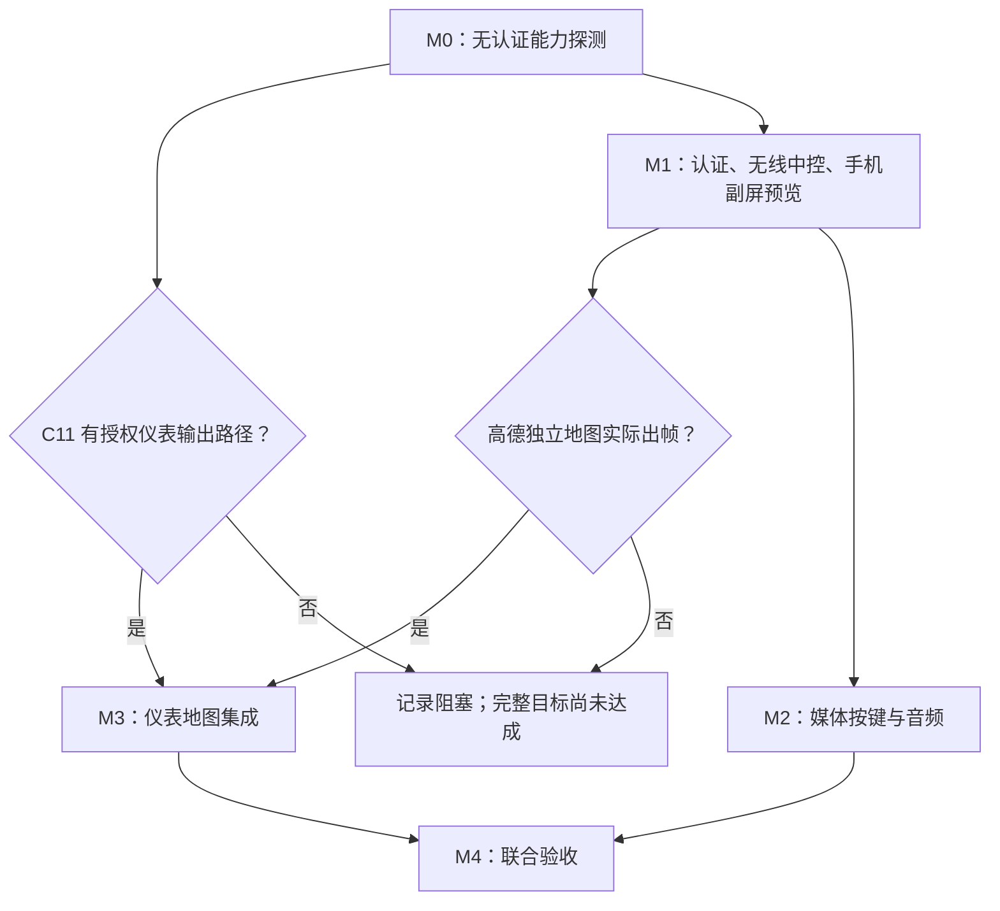

# C11 3.11.40 无线 CarPlay：功能可行性与实现计划

日期：2026-09-29。分析基线：`e6135d36e6a64ad85a94795b2dcbd54e826fa4c0`。本文件记录实施设计；M0 的独立 `probe` 模块已落实为首版能力探测工具，见 [安装与使用说明](/Users/miyuefe/MyGitHub/ai-space/DiPlay/docs/C11_PROBE.md)。其余无线、方向盘桥接和仪表地图任务仍待实现；没有 C11 实车验收结果。

## 1. 固定目标与关键结论

| 项目 | 本轮基线 |
| --- | --- |
| 车辆 | 2024 款零跑 C11，纯电 580 km 尊享款 |
| 车机版本 | 3.11.40，由用户提供；Android API/完整 build fingerprint 待采集 |
| 安装 | 用户确认允许第三方 APK；无需再次把“能否安装”作为未知政策 |
| 手机 | iPhone 13，iOS 27.0 |
| 地图 | 高德地图；App 版本待记录，苹果地图仅作协议验证对照 |
| 核心交付 | 无线连接 + 中控画面/触控/声音 + 方向盘媒体控制 + 仪表高德地图 |
| 未知 | ADB 可用性、蓝牙 RFCOMM/热点权限、仪表显示服务与权限、认证材料是否可用 |
| 范围外 | 副驾屏、空调/车门等车控、有线方案完整适配、CarPlay Ultra |

**中控无线方案具备可复用的协议和渲染基础；方向盘媒体键具备明确的桥接方案；仪表高德地图是决定整个目标能否达成的主要未知。** 不给缺少实测依据的成功百分比。

3.11.40 不等于 Android 11 或 API 31。此次公开检索没有找到能确认这版 C11 的第三方仪表接口或权限表的官方文档；新版官网、其他年款或其他零跑车型不作为本车接口证据。

“仪表地图”的成功定义是：高德正在导航时，仪表呈现同一导航会话的地图，且中控切换到 CarPlay 音乐等界面时仪表仍能继续显示地图。中控 Dashboard 的地图卡片、仪表转向箭头和主屏镜像分别是不同能力，不能混为已完成。

## 2. 三项核心功能的实现可能性

### 2.1 无线连接和中控：条件性较高

优先使用 **车机现有热点 + 蓝牙 RFCOMM 建立 iAP2 + Wi-Fi 承载 CarPlay**。手机是车机热点的客户端，不能把“让车机连接 iPhone 个人热点”当成现有方案的等价替换。

已有代码覆盖：热点发现、手动热点配置、地址选择、接口内 mDNS、蓝牙 iAP2、认证、无线切换、控制通道、H.264/H.265、音频和触控。`WirelessConnectionProof` 已要求认证通道就绪及视频实际渲染，适合继续作为连接成功依据。

实现重点：

1. 用户首次在车机设置开启热点并完成蓝牙配对；应用选择已配对的 iPhone。先不假设普通 APK 可以自动开热点或读取热点密码。
2. 探测热点的实际接口、IPv4/带 scope 的 IPv6、可达性和频段；沿用接口内发现，不写死 `wlan1` 或固定 IP。5 GHz 能用时优先，2.4 GHz 作为测试回退，频段本身不构成稳定性证明。
3. `attachWireless()` 只建立无线监听，不创建 TUN/VPN。服务名包含 VPN 不代表无线流程需要用户授予 VPN；不能把有线 VPN 流程当无线前置条件。
4. 首版使用 H.264 / 30 fps，按中控可用窗口比例选择码流尺寸，保留系统车控栏和返回入口；之后再提高分辨率和帧率。
5. 网络连接、认证、首帧、音频分别报告状态；失败按层归因。手机联网、原厂蓝牙 A2DP/HFP 共存、锁屏和休眠后重连都需单独测。
6. 主路径不可用时再验证 Wi-Fi Direct。现有代码要求 API 29+，还依赖 P2P Group Owner 和实际频段能力；不能只看硬件支持 Wi-Fi 就认定可行。

当前源码不含运行认证材料；完整连接包必须显式提供可用认证。能力探测 APK 应独立于 `DiPlayBootstrap`，即使没有认证材料也能完成显示和输入探测。

源码证据：[无线启动](/Users/miyuefe/MyGitHub/ai-space/DiPlay/shared/src/main/java/com/shilapi/xcertplay/orchestration/CarPlayController.kt:779)、[无线服务接入](/Users/miyuefe/MyGitHub/ai-space/DiPlay/shared/src/main/java/com/shilapi/xcertplay/network/CarPlayVpnService.kt:123)、[连接确认](/Users/miyuefe/MyGitHub/ai-space/DiPlay/shared/src/main/java/com/shilapi/xcertplay/orchestration/WirelessConnectionProof.kt)、[手动热点](/Users/miyuefe/MyGitHub/ai-space/DiPlay/shared/src/main/java/com/shilapi/xcertplay/network/ManualHotspotManager.kt)。

### 2.2 方向盘：媒体控制优先，语音/电话分开验收

已有 `AirPlaySession.sendMedia()`、`sendKnob()`、`sendTelephony()`、`invokeSiri()`，并在信息协商中声明了对应 HID 设备。但检索未发现 Android `MediaSession`、媒体 KeyEvent 接入或音频焦点管理，当前不能声称方向盘已经可用。

建议输入链路：

```text
系统实际分发的媒体按键
        ↓
Android MediaSession 回调（可在中控 Activity 离开后接收）
        ↓
连接会话拥有者：按键归一化、去重、连接代际检查
        ↓
CarPlayController 的有类型命令入口
        ↓
当前 AirPlaySession → iPhone
```

优先使用 Android framework `MediaSession`，适合现有 AudioTrack/远端 iPhone 控制结构；无需为了接方向盘引入一套本地播放器。只有当前窗口收到而 MediaSession 收不到的必要非媒体键，才使用 Activity 的 `dispatchKeyEvent` 作为补充。两条路径共享去重逻辑；只在命令实际被接受时消费事件。

| 按键/行为 | 首选处理 | 必须验证 |
| --- | --- | --- |
| 上一首、下一首 | MediaSession → 现有媒体 HID 报告 | 前台/后台、短按/长按、没有双重触发 |
| 播放、暂停、播放暂停切换 | 各自映射到明确媒体命令 | 不把明确暂停误当 toggle；远端状态反馈准确 |
| 音量滚轮 | 原厂系统调整实际扬声器音量 | 不重复转发导致双步音量，不错误控制 iPhone 音量 |
| Siri/语音键 | 若系统分发或有授权映射，再调用 `invokeSiri()` | 是否被零跑助手独占；是否出现两套语音同时唤醒 |
| 接听、挂断 | 结合来电状态及现有电话命令实测 | HFP/原厂电话是否截获，语音通路是否切换正确 |
| CarPlay 焦点移动、确认、返回 | 只对实际可获取且允许映射的键使用 `sendKnob()` | 不占用车辆/仪表菜单的既有控制键 |

命令索引必须依据 `AirPlayHid` 自己声明的 descriptor 映射，并加枚举/测试；Android KeyCode 不能直接当 HID index。重连时丢弃旧会话积压命令，按下/释放成对，长按重复不能把一次切歌扩成多次。

MediaSession 按真实连接及播放状态启停。现有代码尚未提供完整 now-playing/playback 状态桥接，应确认可用 iAP2 元数据并实现必要反馈；数据未知时不要虚构正在播放或曲目。音频焦点丢失、电话和导航播报需落实到实际音频输出，不仅更新通知栏。

Android 的媒体按键机制提供了这条标准路径，但不能保证厂商一定将方向盘事件交给第三方。若在实际媒体播放时仍收不到，下一步是确认已安装系统组件暴露的文档化/授权媒体接口；本轮不预设 root、CAN 或全局按键注入。[Android 媒体按键机制](https://developer.android.com/media/legacy/media-buttons)、[MediaSession API](https://developer.android.com/reference/android/media/session/MediaSession)

源码证据：[协议命令](/Users/miyuefe/MyGitHub/ai-space/DiPlay/shared/src/main/java/com/shilapi/xcertplay/airplay/AirPlaySession.kt:172)、[HID 声明及编码](/Users/miyuefe/MyGitHub/ai-space/DiPlay/shared/src/main/java/com/shilapi/xcertplay/airplay/AirPlayHid.kt)、[控制器现有触控命令入口](/Users/miyuefe/MyGitHub/ai-space/DiPlay/shared/src/main/java/com/shilapi/xcertplay/orchestration/CarPlayController.kt:345)。

### 2.3 仪表地图：两个独立条件必须同时满足

**条件 A：C11 普通应用拥有真实可用的仪表输出路径。**

首先由探测 APK 在自身 UID 下枚举可见显示、显示属性和实际窗口尺寸。结合原厂仪表导航开关前后的变化确认目标，不预设 `displayId=1`，也不按分辨率猜屏幕用途。仅在识别到供导航呈现的目标区域后，停车显示短时、小范围测试图验证进入/退出；不可盲目向每块屏幕铺满窗口。

按结果选择：

| 实测分支 | 实现路径 | 结论 |
| --- | --- | --- |
| 对普通应用公开、允许窗口呈现的导航显示层 | `Presentation` + 第二流解码 Surface + C11 实测布局 | 最接近现有实现，可以做适配 |
| 通过厂商导航服务或 AAOS cluster 服务管理 | 检查实际 API、签名/权限、授权方式，再接显示 Surface 或 renderer | 条件性可行，不能靠清单声明取得特权 |
| 仪表在另一进程/系统，只接受私有视频接口 | 需要厂商提供传输与仲裁接口 | 当前普通 APK 路径不足以实现 |
| 只有箭头/路名数据接口 | 只能实现导航提示 | 不满足独立地图核心要求 |
| 无可见导航层且无可调用接口 | 暂停仪表实现并明确阻塞 | 中控可继续，但整体需求不能验收 |

`DisplayManager` 能枚举显示不证明 `Presentation.show()` 可成功；shell 的权限也不等于应用权限。AOSP 仪表机制包含厂商渲染服务、焦点仲裁和受保护权限，文档展示的是平台设计，不能作为 C11 已实现此机制的证据。[Presentation](https://developer.android.com/reference/android/app/Presentation)、[AOSP Instrument Cluster API](https://source.android.com/docs/automotive/displays/cluster_api)

**条件 B：iPhone 13 / iOS 27.0 / 当前高德提供可用的独立仪表地图。**

项目已有 type 110 主屏、type 111 副屏的协议声明和分流解码，但 `CarPlayClusterDisplay.MAP_URL` 固定为 `maps:/car/instrumentcluster/map`，安全区域和物理尺寸也源自 BYD 测量。`/info` 的对端内容目前主要打印为日志，尚未看到完整的高德第二屏选择逻辑。必须把内容探测、入口选择和设备布局配置分开实现。

验证步骤：

1. 在能够建立无线连接的环境里提供一个调试用本地第二屏预览窗，先不依赖 C11 仪表。它只用于验证手机有没有发送独立地图，不能作为真实仪表已打通的证据。
2. 同一 iPhone、同一固件下分别运行苹果地图和用户当前高德，记录 App 版本、对端声明的副屏能力、type 111 建流与实际有效帧、导航开始/结束和主屏切换后的行为。
3. 从真实协商数据和协议依据确定副屏入口/切换方式，不能编造 `amap://...` 并期待它自动成为 CarPlay 仪表流。`altScreenURLs` 有值也不足以证明画面和导航会话正确。
4. 苹果地图成功、高德失败时，把问题定位为地图 App/协议兼容分支；不能用苹果地图成功替代高德验收。两者都失败时继续分离认证、协商和解码原因。

Apple 将第二地图场景和转向元数据作为不同能力介绍，第三方导航 App 需实现对应支持。高德公开 SDK 页面可证明其有 CarPlay 导航集成能力，但不足以确认用户安装的高德 App 在当前 iOS 上输出独立仪表地图；也不能将页面中的 Dashboard 描述视为独立实体仪表证据。[Apple CarPlay 应用能力说明](https://developer.apple.com/videos/play/wwdc2025/216/)、[高德 CarPlay SDK 文档](https://lbs.amap.com/api/navigation-sdk-for-ios/guide/tools/carplay_navi)

两条件通过后，把 type 111 送到 C11 导航区域，依据实测重新定义像素尺寸、裁剪、车标位置和昼夜主题；不复用 BYD 的 1920×720、35%/36% 边界或固件判断。中控 type 110 独立输出。

现有仪表 Presentation 在 `CarPlayHostActivity.onDestroy()` 清理；如果用户回到原厂桌面后仍需仪表导航，必须把仪表宿主迁到会话生命周期管理，并验证服务持有 Presentation 的厂商限制。不能只延长网络连接就认为仪表窗口会持续存在。

源码证据：[固定地图入口及 BYD 参数](/Users/miyuefe/MyGitHub/ai-space/DiPlay/shared/src/main/java/com/shilapi/xcertplay/airplay/CarPlayClusterDisplay.kt)、[双屏协议声明](/Users/miyuefe/MyGitHub/ai-space/DiPlay/shared/src/main/java/com/shilapi/xcertplay/airplay/AirPlayInfoPlist.kt:27)、[分流渲染](/Users/miyuefe/MyGitHub/ai-space/DiPlay/shared/src/main/java/com/shilapi/xcertplay/media/AndroidMediaSink.kt)、[仪表窗口生命周期](/Users/miyuefe/MyGitHub/ai-space/DiPlay/common/src/main/java/com/shilapi/xcertplay/CarPlayHostActivity.kt:724)。

### 不应默认为等价交付的替代方案

- **主屏镜像到仪表**：在显示权限已打通时可以另行评估，但高德必须持续位于主屏，切换音乐后仪表也会跟着变。若实现双输出，需要纹理/EGL 分发或两个解码实例；`MediaCodec.setOutputSurface()` 是切换目标，不是同时复制到两个屏幕。这会增加带宽/解码或 GPU 成本。
- **转向箭头、距离、路名**：依赖高德输出元数据及 C11 对应输出接口；可以作为独立阶段成果，不能称为仪表地图完成。
- **重新用 Android 高德 SDK 画地图**：没有完整路线和同步语义时不等于原 CarPlay 导航会话，且引入另一套 SDK、定位和授权要求；不作为本轮默认路径。

## 3. 代码改动范围

以下为计划中的最小职责划分，新增文件名可在实施时按现有结构调整；不新增通用插件平台。

| 位置 | 计划改动 | 可复用部分 |
| --- | --- | --- |
| `probe` 独立模块；后续 `mobile` C11 变体 | M0 使用无 common/shared 依赖的探测 APK；后续无线包再增加 C11 变体，排除 BYD debug 组件 | 现有 Android 工具链；探测不需要 NDK 或身份资产 |
| `probe/HeadUnitCapabilityProbe` | 已实现 API/ABI、显示、codec 声明、网络/蓝牙元信息报告；真实连接和解码在 M1 验证 | 采用严格字段白名单和独立导出，避免加载 BYD 生命周期 |
| `CarPlayController` | 提供有类型媒体/旋钮/Siri/电话命令入口，绑定当前会话与代际；厂商导航输出默认可禁用 | 认证、无线状态机、触控、重连 |
| `common` 新增 `CarPlayMediaSessionBridge` | 媒体按键和播放状态桥接、焦点协调、断开时释放 | 现有 HID、AudioTrack 和 session service |
| `CarPlayClusterDisplay`、`AirPlaySession` | 类型化解析副屏能力，区分地图内容选择与车机布局；参数化配置 | 第二流协议、pairing、媒体传输 |
| `ClusterMapPresentation` 周边 | 保留 BYD 实现；新增经能力验证的 C11 导航窗口宿主，处理显示热插拔/后台和退出清理 | MediaCodec、Surface 管理和现有布局测试经验 |
| `DiPlaySessionService` / 会话拥有者 | 管理后台媒体输入及仪表宿主；避免 Activity 消失后旧引用、重复实例 | 现有前台连接服务与断开入口 |
| 网络、存储、日志 | 修复原评估 P1：报文/连接限额、阶段超时、来源约束、配对保护、敏感日志过滤 | 现有加密协议、备份隔离和脱敏组件 |

版本配置以真实能力和完整固件指纹为依据。显示 ID 随运行环境可能变化，不固化数值。OTA 后重新检测；不因显示数量相同就认定布局和权限仍兼容。

## 4. 实施阶段、交付与估算

以下为单人有效工程日的初步量级，非交付承诺；假设有可用工具链、可用认证材料、稳定实车反馈，且标准按键/仪表接口能够访问。等待车辆、认证或厂商授权的时间不计入。若需要新的私有仪表接口支持，则不沿用本估算。

| 阶段 | 工作与交付 | 完成条件 | 估算 |
| --- | --- | --- | --- |
| M0：能力探测与基础构建 | C11 专用探测包、脱敏 JSON/文本报告；采集 3.11.40 指纹、按键路径、导航显示候选；准备可复现构建 | 普通 APK 能运行；方向盘和仪表可达性有实际证据；认证输入是否具备单独记录 | 2–3 日 |
| M1：无线原型与地图内容验证 | iPhone 13 / iOS 27.0 热点无线连接、中控触控/音频；调试第二屏分别测试高德和苹果地图 | 无线链路可重复；高德独立副屏结果明确，不只记录协商字段 | 3–5 日 |
| M2：方向盘与声音 | MediaSession、有类型命令、去重、状态反馈、音频焦点；标准媒体键通过；语音/电话单列 | 主界面、原厂桌面、锁屏/重连场景没有丢键/重复切歌或音源冲突 | 2–4 日 |
| M3：C11 仪表宿主 | 用已验证的显示接口呈现真实 type 111；实测安全区、主题和窗口生命周期 | 高德导航双屏同时工作，中控切换界面后仪表仍更新，原厂信息可见 | 4–8 日 |
| M4：联合回归与加固 | 网络/存储/日志加固、休眠/断线/资源回归、安装包和兼容性记录 | 下表核心验收通过，形成可复现测试记录和已知限制 | 3–5 日 |

有利条件下合计约 **14–25 个工程日**。M0 的车端仪表权限和 M1 的高德独立副屏是早期决策点：任一不成立，及时报告完整目标受阻，不能把 M3 当成靠增加时间必然能解决的普通开发工作。安全加固随各模块修改落实，M4 负责联合复核。

### 阶段依赖



M3 同时依赖 D、G 为“是”；图中箭头不表示满足其一就足够。探测包不需要认证；M1 的手机内容验证需要真实 CarPlay 会话。

## 5. 建议验收标准

下列数量是建议的首轮验收门槛，尚无实測数据；执行时记录成功次数、耗时、日志和异常，避免只记录“可用”。

| 项目 | 验收方法与通过条件 |
| --- | --- |
| 无线连接 | 前置条件相同的 10 次连接均成功；分别记录首次配对与已配对重连耗时，从蓝牙/热点就绪开始计时；无需 USB 或日常 ADB |
| 中控 | 触控边缘、返回、地图缩放和主屏切换正常；连续 60 分钟高德导航+音乐，无崩溃/ANR或持续黑屏；记录声音中断和重连次数 |
| 媒体按键 | 上一首/下一首/播放暂停各 20 次，无重复和遗漏；前台与原厂桌面各测；原厂音量滚轮正常且没有双重调节 |
| Siri/电话 | 若纳入交付，分别测试唤醒、退出、呼入、接听、挂断和导航恢复；若系统不分发对应键，明确列为未支持，不掩盖为“方向盘全部支持” |
| 高德仪表地图 | 使用记录版本的高德，开始/重算/结束路线；主屏切音乐后仪表地图继续更新；同一导航会话、车标及转向内容正确，不以苹果地图或箭头代替 |
| 仪表窗口 | 原厂速度和告警始终可见；导航模式切换、显示移除、离开中控页面后行为符合设计；不可访问时可靠回退到原厂显示 |
| 生命周期 | 5 轮实际锁车休眠/唤醒，不能用进程重启模拟替代；另测蓝牙、热点关闭/恢复和手机离车返回，记录是否需手动开热点 |
| 退出和异常 | 主动断开、系统回收/强制停止、手机掉线后，没有残留指令、不可退出覆盖层或继续截获的媒体键；逐条记录平台不能保证的行为 |
| 原厂共存 | 原厂导航/音乐、电话、倒车影像接管时表现正常；无重复播音或双语音助手 |
| 安全与回归 | 超长/未完成报文、重复连接、认证前非法阶段消息不能无限占用资源；旧会话命令不可落到新会话；导出文件不含密钥、SSID/密码或配对记录；BYD 路径原有测试不回退 |

仅对改变的协议边界、状态机、按键去重、显示选择和生命周期增加有意义的单元/组件测试；真实热点、方向盘分发、显示权限和厂商后台策略必须用实车验证。模拟器双屏通过不能替代 C11 仪表验证。

## 6. 下一步最小行动

首先实现 **不需要认证材料的 C11 能力探测 APK**：一键导出能力报告，单独进入媒体按键测试，提供受控的导航显示区域验证。它应能经现有 APK 安装渠道使用，ADB 是可选诊断手段。

同时明确本地认证输入是否具备，并补记高德 App 版本；这不阻碍探测包先完成。随后才交付无线原型，以苹果地图作对照实测高德第二屏。当前不需要再询问用户车型、车机版本或是否允许安装。

实施状态：M0 已有独立能力探测实现，详情和使用边界见 [C11 探测说明](/Users/miyuefe/MyGitHub/ai-space/DiPlay/docs/C11_PROBE.md)。尚未连接目标车机或取得任何仪表/无线实测结果。完整架构与安全审查背景见 [原评估报告](/Users/miyuefe/MyGitHub/ai-space/DiPlay/docs/LEAPMOTOR_C11_2024_ASSESSMENT.zh-CN.md)。
